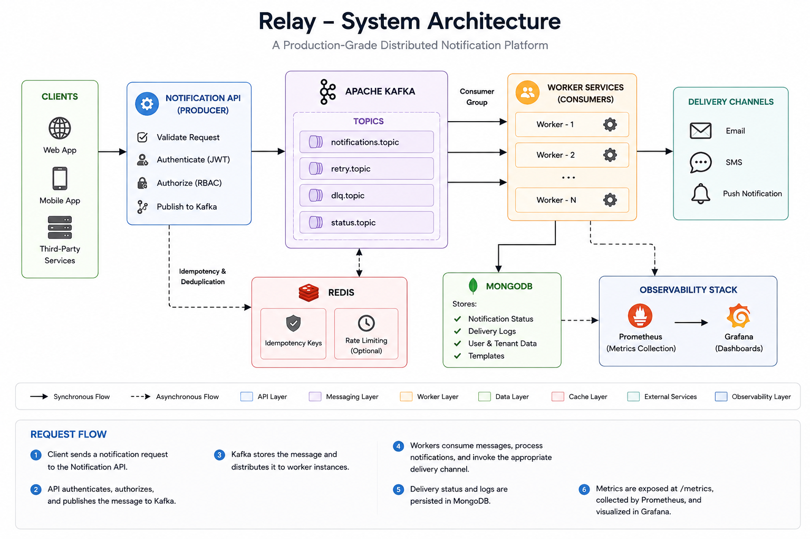

# 🚀 Relay


### Production-Grade Distributed Notification Platform

Relay is a production-grade distributed notification platform built to demonstrate modern backend engineering practices, including asynchronous messaging, fault-tolerant processing, horizontal scalability, distributed caching, and production observability.

---

**Built With**

Node.js • Kafka • Redis • MongoDB • Docker • Prometheus • Grafana

---

> Designed to simulate large-scale notification infrastructure powering Email, SMS, and Push delivery pipelines.


## 📚 Table of Contents

- [Problem Statement](#-problem-statement)
- [Design Goals](#-design-goals)
- [Feature Highlights](#-feature-highlights)
- [System Architecture](#️-system-architecture)
- [Technology Stack](#️-technology-stack)
- [Codebase Structure](#-Codebase-Structure)
- [Engineering Decisions](#-engineering-decisions)
- [Observability](#-observability--monitoring)
- [Quick Start](#-quick-start)
- [API Example](#-api-example)
- [Future Enhancements](#️-future-enhancements)
- [License](#-license)

## 🏗️ System Architecture

The following architecture illustrates how Relay decouples API request handling from notification processing using Apache Kafka, enabling reliable asynchronous execution, independent service scaling, and fault-tolerant message delivery.

<p align="center">
  
</p>

### Request Flow

1. A client submits a notification request to the Notification API.
2. The API validates the request and publishes a message to an Apache Kafka topic.
3. Kafka distributes messages across worker instances using consumer groups.
4. Workers process notifications asynchronously and invoke the appropriate delivery channel.
5. Delivery status, retries, and failures are persisted for auditing and recovery.
6. Prometheus collects operational metrics that are visualized through Grafana dashboards.


## 📖 Problem Statement

Modern applications rely on multiple communication channels such as Email, SMS, and Push Notifications to deliver critical information to users. Processing these notifications synchronously can introduce high latency, tight service coupling, reduced availability, and poor scalability under increasing traffic.

Relay addresses these challenges by adopting an event-driven architecture built on Apache Kafka, where notification requests are processed asynchronously through distributed worker services. This architecture improves reliability, enables horizontal scaling, isolates failures, and provides production-grade observability for high-throughput notification processing.


## 🎯 Design Goals

Relay was designed with the following engineering objectives:

- Build a fault-tolerant asynchronous notification pipeline.
- Decouple producers from notification processing using Apache Kafka.
- Support horizontal worker scaling through Kafka consumer groups.
- Ensure reliable message delivery using retries, idempotency, and dead-letter queues (DLQs).
- Provide production-grade observability through Prometheus metrics and Grafana dashboards.
- Containerize the platform for reproducible local development and deployment.


## ✨ Feature Highlights

### ⚡ Event-Driven Processing

- Asynchronous notification processing using Apache Kafka.
- Producer-consumer architecture for decoupled services.
- Support for Email, SMS, and Push notification channels.
- Configurable notification templates and user preferences.


### 🛡️ Reliability & Fault Tolerance

- Retry queues for transient failures.
- Dead Letter Queue (DLQ) for failed message isolation.
- Idempotent request processing to prevent duplicate deliveries.
- Request deduplication using unique request identifiers.


### 📈 Scalability

- Horizontal worker scaling using Kafka consumer groups.
- Independent API and worker services for better resource utilization.
- Stateless service design enabling containerized deployment.
- Multi-tenant architecture supporting logical tenant isolation.


### 🔐 Security

- JWT-based authentication.
- Role-Based Access Control (RBAC).
- Secure REST API endpoints.
- Tenant-aware request authorization.


### 📊 Observability

- Prometheus metrics for application monitoring.
- Grafana dashboards for operational visibility.
- Worker health monitoring.
- Structured logging for production diagnostics.


### 🚀 Deployment

- Dockerized microservices.
- Docker Compose local orchestration.
- MongoDB Atlas support.
- Railway cloud deployment.


## 🛠️ Technology Stack

| Layer | Technologies |
|----------|--------------|
| **Backend** | Node.js, Express.js |
| **Messaging** | Apache Kafka, KafkaJS |
| **Database** | MongoDB, MongoDB Atlas |
| **Caching** | Redis |
| **Authentication** | JWT |
| **Containerization** | Docker, Docker Compose |
| **Monitoring** | Prometheus, Grafana |
| **Deployment** | Railway |


## 📂 Codebase Structure
```text
src
├── api/          # REST API endpoints
├── config/       # Kafka, database, and application configuration
├── metrics/      # Prometheus metrics
├── models/       # MongoDB models
├── services/     # Business logic
├── worker/       # Kafka consumers and notification processing
└── index.js      # Application entry point

```


## 🧠 Engineering Decisions

Relay was designed by prioritizing scalability, reliability, and operational simplicity. The following architectural decisions were made to simulate production-grade distributed systems.

### Why Apache Kafka?

Kafka decouples API request handling from notification processing, allowing producers and consumers to scale independently. It also provides durable message persistence, consumer groups, and fault-tolerant asynchronous processing.


### Why Asynchronous Processing?

Sending notifications synchronously increases API latency and tightly couples request handling with downstream services. Processing notifications asynchronously improves responsiveness, isolates failures, and increases system throughput.


### Why Consumer Groups?

Kafka consumer groups enable horizontal worker scaling while ensuring each notification is processed exactly once within a consumer group, allowing throughput to increase simply by adding more worker instances.


### Why Retry Queues & Dead Letter Queues?

Transient failures are automatically retried, while permanently failed messages are moved to a Dead Letter Queue (DLQ). This prevents message loss, avoids blocking healthy traffic, and enables manual investigation when necessary.


### Why Idempotency?

Distributed systems must tolerate duplicate message delivery. Relay uses unique request identifiers to ensure repeated requests do not produce duplicate notifications.


### Why Prometheus & Grafana?

Operational visibility is essential in distributed systems. Prometheus collects application metrics while Grafana visualizes throughput, worker health, retry rates, consumer lag, and overall platform performance.


### Why Docker?

Docker provides a consistent runtime environment across development and deployment, simplifying local setup and making the platform easier to deploy and scale.


## 📊 Observability & Monitoring

Relay was designed with observability as a first-class concern to provide operational visibility into distributed message processing.

### Metrics Collected

- Notification throughput
- Kafka consumer lag
- Worker health status
- Retry count
- Dead Letter Queue (DLQ) activity
- Failed notification count
- Processing latency

### Monitoring Stack

- **Prometheus** collects application and infrastructure metrics.
- **Grafana** visualizes dashboards for real-time monitoring and operational insights.

This enables engineers to identify processing bottlenecks, monitor worker performance, detect message failures, and analyze overall system health.

## 📋 Prerequisites

Before running Relay locally, ensure the following tools are installed:

- Node.js 18+
- Docker Desktop
- Apache Kafka
- MongoDB
- Git

## 🚀 Quick Start

### Clone the Repository

```bash
git clone https://github.com/Manikanta-kovvuri/relay.git

cd relay
```

### Install Dependencies

```bash
npm install
```

### Start the Platform

```bash
docker compose up --build
```

This launches:

- Notification API
- Kafka
- Zookeeper
- Worker Services
- MongoDB
- Prometheus
- Grafana


## 📬 API Example

### Send Notification

**Endpoint**

```http
POST /api/send
```

**Request**

```json
{
  "requestId": "123",
  "to": "user@gmail.com",
  "message": "Hello",
  "channel": "email"
}
```

**Response**

```json
{
  "success": true,
  "id": "xyz123"
}
```


## 🛣️ Future Enhancements

- API Gateway
- Kubernetes deployment
- Distributed rate limiting using Redis
- Exponential backoff retry strategy
- OpenTelemetry distributed tracing
- Notification scheduling
- Multi-region deployment
- CI/CD pipeline with GitHub Actions


## 📄 License

Licensed under the MIT License.