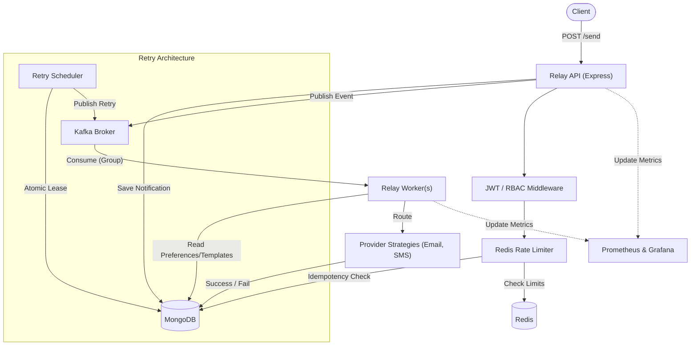

# Relay

Relay is a highly reliable, distributed asynchronous notification platform designed to decouple ingestion from delivery while protecting downstream providers. It ensures that notifications are captured, queued, and processed robustly across horizontal workers without dropping requests.

Node.js • Apache Kafka • Redis • MongoDB • Docker • Prometheus • Grafana

Relay demonstrates fundamental distributed systems concepts:
- **Asynchronous event-driven processing**
- **Horizontal worker scaling**
- **At-least-once processing**
- **Application-level idempotency**
- **Retry and DLQ handling**
- **Multi-tenant isolation**
- **Redis-based rate limiting**
- **Observability**
- **Fault recovery**

## Why Relay?

In typical web applications, synchronous notification delivery creates severe coupling. When an API synchronously calls an email or SMS provider (like SendGrid or Twilio), provider latency spikes propagate directly to the application, tying up threads and degrading user experience. If the provider goes down, the API request fails and the notification is lost.

Relay separates ingestion from delivery. It safely persists the notification intent, acknowledges the client instantly, and publishes an event to Kafka. Scalable background workers consume these events to execute delivery at their own pace, automatically handling transient provider failures via retry schedulers and dead letter queues (DLQs).

## Engineering Highlights

- **Kafka Producer/Consumer Architecture**: Decouples the API layer from delivery mechanics.
- **Kafka Consumer Groups**: Enables horizontal scaling; multiple workers can consume the same topic without duplicate processing.
- **At-Least-Once Processing**: Kafka guarantees messages are delivered to workers at least once, ensuring no notification drops.
- **Application-Level Idempotency**: Guard against duplicate requests via deterministic `tenantId` + `requestId` composite unique index in MongoDB.
- **Redis Rate Limiting**: Distributed rate limiting prevents single tenants from noisy-neighbor behaviors.
- **JWT Authentication & RBAC**: Secures endpoints and segregates access controls (USER, ADMIN, OWNER).
- **Tenant Isolation**: Every database interaction and request is strictly scoped by `tenantId`.
- **Retry Scheduling & Recoverable Leases**: Transient failures are scheduled for future retries. Schedulers use atomic lease claims (`findOneAndUpdate`) to prevent multiple workers from publishing the same retry event concurrently.
- **Dead Letter Queue (DLQ)**: Messages that exceed `MAX_RETRIES` are permanently routed to a DLQ state for manual inspection.
- **Exponential Backoff**: Prevents thundering herds against external providers during outages.
- **Provider Abstraction**: A factory pattern resolves abstract `EMAIL` or `SMS` targets to specific strategies.
- **Templates & Preferences**: Demonstrates user-level opt-outs and runtime variable interpolation.
- **Prometheus & Grafana**: Exposes precise bounds-capped metrics (e.g., `notifications_sent_total`, `rate_limit_rejections_total`) to visualize throughput.
- **Structured Pino Logging**: Ensures that high-cardinality values (like UUIDs) remain in search-friendly structured logs instead of causing label-explosion in Prometheus.
- **Health/Readiness Semantics**: Strict dependency validation across Mongo, Redis, and Kafka brokers ensures Kubernetes or load balancers never route traffic to isolated pods.
- **Graceful Shutdown**: Properly releases network sockets, timers, and Kafka consumers on exit.

## System Architecture



## Request Lifecycle

1. **Authentication**: The client passes a JWT.
2. **Authorization**: Middleware validates RBAC rules and extracts the context `tenantId`.
3. **Rate Limiting**: Redis increments the tenant's request count. If exceeded, a 429 response is returned immediately.
4. **Idempotency**: MongoDB enforces a unique constraint on `{ tenantId, requestId }`. Duplicates receive a `200 OK` with the existing ID.
5. **Persistence**: The notification is saved to MongoDB in a `QUEUED` state.
6. **Publishing**: An event containing the notification `id` is pushed to the Kafka `notifications` topic.
7. **Consumption**: A worker in the Kafka consumer group claims the message.
8. **Resolution**: The worker looks up the user's preferences (e.g., opted-out channels) and notification templates.
9. **Dispatch**: The abstract provider factory selects the implementation strategy (e.g., Email, SMS) and executes it.
10. **Outcome**: The worker updates the MongoDB state to `SENT` or `FAILED`.
11. **Retries**: Transient failures transition to `RETRYING`. A background lease-based scheduler wakes up, atomically claims the retry, and republishes it to Kafka with an exponential backoff.
12. **DLQ**: If `MAX_RETRIES` (3) is exceeded, the notification is permanently marked as `DLQ`.

## Reliability Model

Relay uses an at-least-once processing model with application-level idempotency.

- **Why duplicate delivery happens**: In distributed systems (and Kafka explicitly), network partitions, worker crashes, or consumer rebalances can cause a message to be delivered more than once.
- **Application-Level Idempotency**: By explicitly utilizing `{ tenantId: 1, requestId: 1 }` inside MongoDB, Relay natively ignores subsequent duplicate HTTP requests and subsequent duplicate Kafka consumptions by checking if a message was already processed.
- **Retry behavior**: If a provider fails, the notification is set to `RETRYING`. A scheduler picks it up, marks it as `RETRY_PUBLISHING` (claiming the lease), and pushes it to Kafka.
- **Recoverable retry claims**: If a worker crashes during retry publishing, its lease abandons. A cleanup mechanism automatically unlocks leases older than 60 seconds, returning them to `RETRYING` so another worker can claim them.

## Horizontal Scalability

- **Kafka Partitions**: The notification topic allows multiple workers to subscribe in parallel.
- **Consumer Groups**: By sharing the `notification-workers` group, Kafka handles the partition distribution so no two workers process the same exact offset.
- **Independent Scaling**: The API instances and Worker instances scale independently of each other.
- **Concurrency Safety**: Workers independently run their own retry schedulers. The atomic MongoDB `findOneAndUpdate` guarantees only one worker can lease a specific retry record at a time.

## Multi-Tenant Security

- **JWT & RBAC**: Every request mandates a valid token. Roles (USER, ADMIN, OWNER) enforce distinct operation boundaries.
- **Tenant Isolation**: The `tenantId` is derived from the verified JWT payload, not the request body, preventing spoofing. Every MongoDB query uses this `tenantId` to ensure cross-tenant data leaks are impossible.
- **Password Hashing**: User passwords utilize bcrypt with robust salt rounds.

## Distributed Rate Limiting

- **Redis-Backed**: Local in-memory rate limiters fail in distributed setups. Relay utilizes Redis to synchronize limits across all horizontal API instances.
- **Tenant-Scoped**: Rate limits are bucketed per `tenantId`, guaranteeing noisy-neighbor isolation.
- **Failure Behavior**: If Redis is unavailable, requests gracefully bypass the rate limiter, preferring availability over strict suppression.
- **Metrics Safety**: Rate limit increments strictly utilize bounded labels. The raw `tenantId` is deliberately excluded from the Prometheus counters to avoid cardinality explosions.

## Notification Processing

- **Provider Abstraction**: Delivery logic is hidden behind a factory pattern, allowing dynamic swapping of implementations based on `channel`.
- **Templates**: Centralized `Template` models provide text schemas that interpolate runtime variables.
- **User Preferences**: Users can globally opt-out of specific channels via the `Preference` model. Relay dynamically intercepts and skips delivery if an opt-out is detected.

*(Note: Currently, providers simulate delivery using `console.log` / mock behaviors rather than real external network payloads).*

## Observability

- **Prometheus & Grafana**: Dedicated endpoints `/metrics` emit node performance and business logic statistics.
- **Pino Structured Logs**: Deep context (e.g., UUIDs, request IDs, error stacks) are logged via standard JSON for SIEM / ELK stack ingestion.
- **Cardinality Protection**: A key engineering decision in Relay is strict isolation of identifiers. `requestId` and `tenantId` are omitted from Prometheus labels and instead remain exclusively in Pino logs. This ensures Prometheus RAM utilization remains bounded over time.

## Failure Scenarios

| Failure | System behavior |
|---|---|
| Kafka unavailable | API marks notification as saved but readiness probe `GET /ready` begins failing with 503 HTTP status. |
| Redis unavailable | Rate limiting is gracefully bypassed; API readiness probe returns 503 HTTP status. |
| MongoDB unavailable | API readiness probe fails with 503; request ingestion fails loudly avoiding data loss. |
| Worker crashes | Kafka consumer group automatically rebalances the partition to another healthy worker. |
| Provider failure | Notification is marked `RETRYING` and scheduled with exponential backoff. |
| Retry publish failure | Atomic lease times out; a healthy worker recovers the lease and retries. |
| Maximum retries reached | Notification transitions to `DLQ` and halts processing. |
| Duplicate request | Database unique constraint blocks insert. API returns 200 OK with the originally generated ID. |

## Technology Stack

| Layer | Technology | Purpose |
|---|---|---|
| Framework | Node.js / Express | Lightweight, async event-loop HTTP server |
| Broker | Apache Kafka (KafkaJS) | Decoupled event distribution and log persistence |
| Datastore | MongoDB (Mongoose) | Flexible document persistence and atomic state transitions |
| Cache / Limits | Redis (ioredis) | High-speed distributed counter |
| Security | JWT / bcrypt / Helmet | Authentication, RBAC, hashing, HTTP header security |
| Observability | Prometheus / Grafana / Pino | Metrics aggregation, visualization, and structured logging |
| Testing | Jest / supertest / mongo-memory-server | Isolated execution, endpoint simulation, and mocks |

## Repository Structure

```text
CWD: relay/
├── docker-compose.yml
├── Dockerfile
├── Dockerfile.worker
├── eslint.config.js
├── grafana
│   ├── dashboards
│   └── provisioning
├── package.json
├── prometheus.yml
├── src
│   ├── api
│   │   ├── auth.routes.js
│   │   └── notification.routes.js
│   ├── config
│   │   ├── db.js
│   │   ├── kafka.js
│   │   └── redis.js
│   ├── index.js
│   ├── metrics
│   │   └── metrics.js
│   ├── middleware
│   │   ├── auth.middleware.js
│   │   └── rate-limit.middleware.js
│   ├── models
│   │   ├── notification.model.js
│   │   ├── preference.model.js
│   │   ├── template.model.js
│   │   └── user.model.js
│   ├── services
│   │   └── providers
│   │       └── index.js
│   └── worker
│       └── worker.js
└── tests
    └── unit
        ├── api.test.js
        ├── auth.test.js
        ├── models.test.js
        ├── rate-limit.test.js
        └── worker.test.js
```

## Testing

The system implements rigorous unit testing validating the fundamental architectural behaviors.

**Current Result**:
- **Test Suites**: 5
- **Tests**: 8
- **Coverage**: 54.37% (Stmts)

**What is Tested**:
- **Authentication**: JWT signing, hashing, RBAC downgrading.
- **Idempotency**: API behavior against deterministic duplicate requests.
- **Models**: State constraints and transitions.
- **Rate Limiting**: Distributed increments and HTTP 429 blockades.
- **Worker Processing**: Resolution of preferences, templates, and provider target logic.

*(Coverage remains at ~54% focused on critical paths. Full external provider mocking remains a vector for future tests).*

## Local Development

Ensure Docker and Node.js are installed on your machine.

```bash
# 1. Install dependencies
npm install

# 2. Launch infrastructure (Kafka, Zookeeper, Mongo, Redis, Prometheus, Grafana)
docker compose up -d

# 3. Format and Lint code
npm run format
npm run lint

# 4. Run tests and view coverage
npm test -- --coverage
```

## Docker Architecture

- `api`: Exposes port 3000. Handles JWT ingestion and persists notifications.
- `worker`: Consumes Kafka topic `notifications`. Operates out of bounds.
- `kafka` / `zookeeper`: The confluentinc cp-kafka broker managing asynchronous distribution.
- `mongo`: Persistent state for models, preferences, and idempotency logic.
- `redis`: Distributed in-memory data store for the rate limiter.
- `prometheus`: Scrapes `/metrics` endpoints.
- `grafana`: Exposes port 3001. Visualizes scraped Prometheus metrics.

## Engineering Decisions

**1. Why Kafka instead of synchronous processing?**
Synchronous delivery cascades external provider latencies and failures directly to the end-user. Kafka durably records the intent allowing the API to return immediately while workers execute the HTTP network boundary async.

**2. Why consumer groups?**
Consumer groups allow us to spin up 5 worker instances. Kafka handles routing partitions so that no single worker handles the entire load, and messages are not double-processed across healthy instances.

**3. Why at-least-once instead of exactly-once?**
Exactly-once in Kafka is highly complex and requires transactional outbox patterns extending into MongoDB. At-least-once guarantees delivery, while simple application-level idempotency inside MongoDB mitigates the duplicates.

**4. Why application-level idempotency?**
Idempotency handles network retries perfectly. If the client gets a 500 error but the database committed, the client naturally retries. Relay recognizes the `requestId` and safely returns 200 OK without re-triggering side effects.

**5. Why a DLQ?**
Infinite retry loops consume massive overhead. After exponential backoffs hit the ceiling, we route failures to DLQ to clear the pipeline and allow for manual inspection.

**6. Why Prometheus instead of putting tenant IDs into metrics?**
High cardinality labels (like UUIDs or distinct `tenantId`s) explode Prometheus memory usage. These values belong strictly in structured Pino logs.

**7. How does the retry scheduler remain safe with multiple workers?**
Every worker runs an internal interval loop. However, they use MongoDB's `findOneAndUpdate` to atomically lease the retry row, switching it from `RETRYING` to `RETRY_PUBLISHING`. Only the victor of that race condition actually publishes to Kafka.

## Performance / Scalability

While benchmark numbers have not yet been formally established, Relay scales on two distinct vectors:
- **API Scaling**: Totally stateless. Bounded only by MongoDB ingest limits and Redis counter capacity.
- **Worker Scaling**: Bounded by Kafka partitions. You can increase the partition count of the `notifications` topic to instantly linearly scale worker throughput.

## Security

- **JWT**: Passed exclusively via `Authorization: Bearer <token>`.
- **Bcrypt**: Prevents compromised databases from revealing plain-text passwords.
- **RBAC**: Restricts administrative endpoints.
- **Tenant Isolation**: Every database query rigidly enforces the extracted `tenantId`.
- **Rate Limiting**: Throttles malicious brute-force or noisy-neighbor ingestion.
- **Helmet**: Secures underlying Express HTTP headers.
- **No committed secrets**: Passwords/keys only exist inside environment variables (`process.env`).

## API

### `POST /api/auth/register`
Creates a user and assigns a tenant boundary.

### `POST /api/auth/login`
Returns a JWT token.

### `GET /api/notifications/debug`
*(Admin Only)* Returns raw notification histories for the tenant.

### `POST /api/notifications/send`
Validates limits, ensures idempotency, and enqueues a message.
**Request**:
```json
{
  "requestId": "unique-uuid-1234",
  "to": "user@example.com",
  "message": "Hello from Relay!",
  "channel": "EMAIL"
}
```
**Response (200 OK / 201 Created)**:
```json
{
  "success": true,
  "id": "6a847ce5d4dfe382db36cdac"
}
```

### `GET /health`
Returns 200 OK if Node's event loop is functioning.

### `GET /ready`
Returns 200 OK if Kafka, MongoDB, and Redis are explicitly connected and responsive, or 503 if disconnected.

## Roadmap / Future Enhancements

*Future additions under consideration:*
- Real integration bindings (e.g. AWS SES, Twilio, Firebase).
- OpenTelemetry distributed tracing (Zipkin / Jaeger).
- Kubernetes Helm charts deployment.
- Enhanced provider-level batching.

## License

ISC License. See `package.json` for details.
